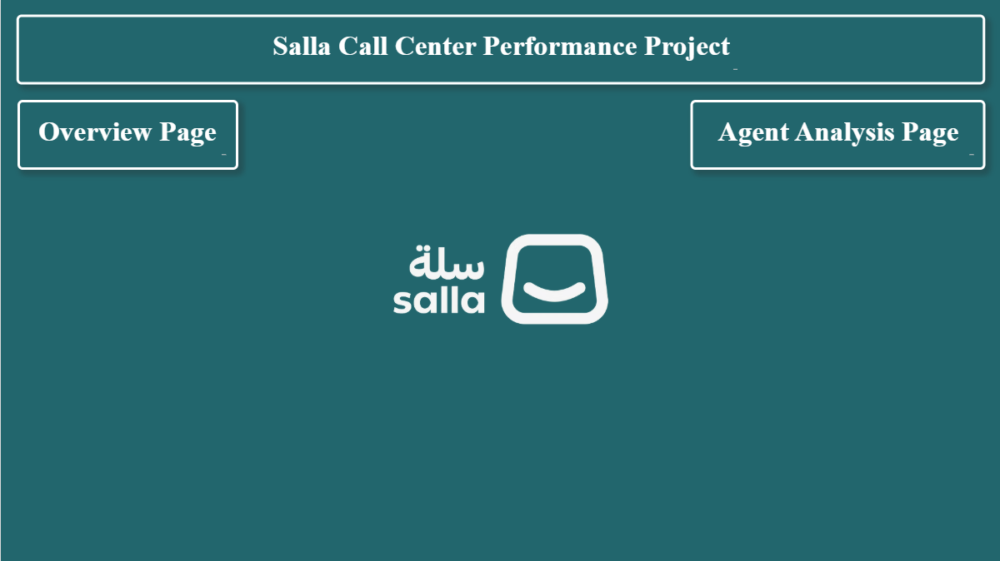
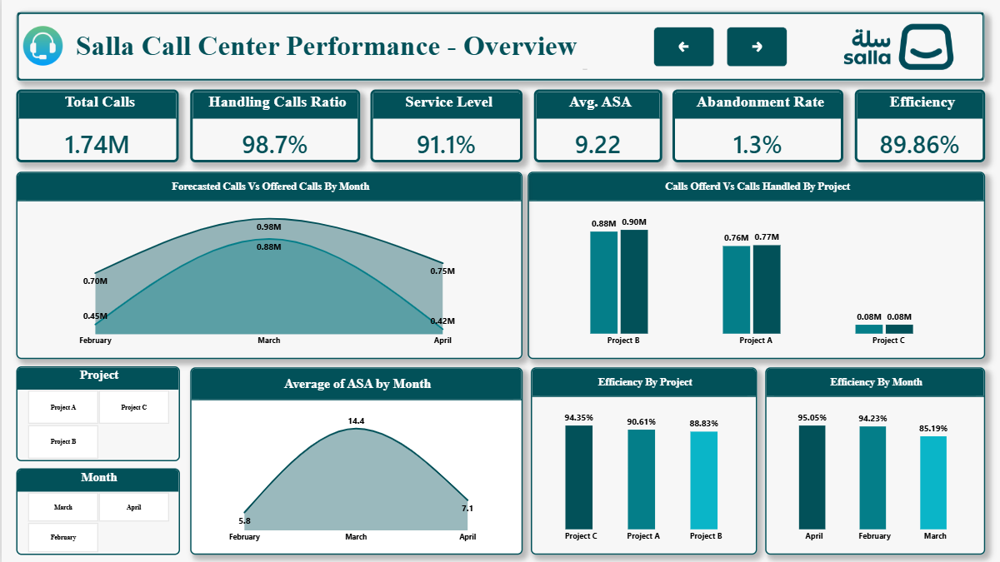
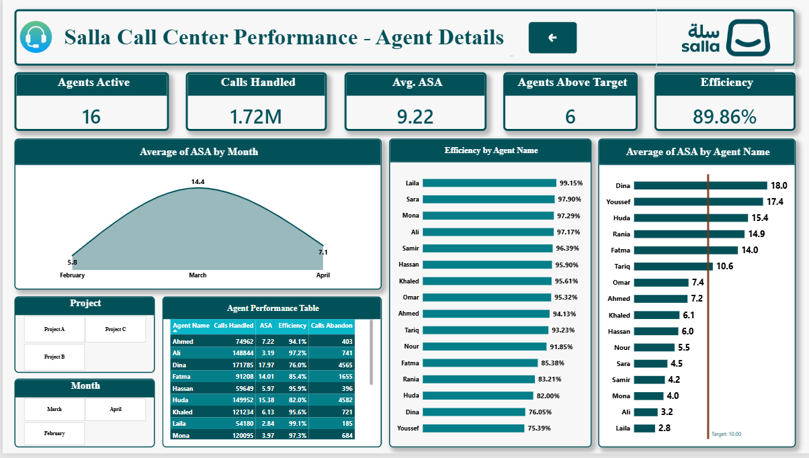

# Salla Call Center Performance Dashboard

A Power BI dashboard analyzing call center performance for a fictional "Salla" support operation, covering call volume, service-level metrics, and individual agent performance across three months (February–April).

Built as a practice project to apply KPI design, DAX measures, and interactive dashboard storytelling on a call center dataset.

---

## Dashboard Pages

| Page | Purpose |
|---|---|
| **Cover** | Landing page with navigation to Overview and Agent Analysis |
| **Overview** | Executive-level view: overall call volume, service metrics, efficiency by project/month |
| **Agent Analysis** | Drill-down into individual agent performance, ranked and benchmarked against targets |

Navigation between pages is handled with bookmark/button-based back-forward controls. Both pages share synced slicers for **Project** and **Month**.

---

## Screenshots

| Cover | Overview | Agent Analysis |
|---|---|---|
|  |  |  |

## Demo Video

A short walkthrough of the dashboard's interactivity (slicers, navigation, drill-down):

https://github.com/USERNAME/REPO_NAME/assets/demo.mp4

> GitHub doesn't render local video files inline in the README preview — either upload the video by dragging it into a GitHub issue/PR comment first (GitHub will host it and give you a permanent `user-images`/`assets` URL to paste here), or link to it if hosted elsewhere (YouTube, Drive).

---

## Data Model

The dataset is a single flat table (one row per agent/project/month) containing: Agent Name, Project, Month, Calls Offered, Calls Handled, Calls Abandoned, ASA (Average Speed of Answer), and Efficiency.

**Note on design choice:** at this scale (16 agents × 3 months), a flat/denormalized table is fine — it avoids unnecessary relationship overhead for a dataset this small. At a larger scale (multi-year data, hundreds of agents, multiple call queues), this would be restructured into a star schema: a `Fact_Calls` table plus `Dim_Agent`, `Dim_Project`, and `Dim_Date` dimension tables. This keeps the model performant and makes time-intelligence functions (MTD, QTD, YoY) straightforward, which flat tables make awkward.

A `Month Number` column with a "Sort by Column" applied to `Month` is required so charts order Feb → Mar → Apr chronologically instead of alphabetically.

---

## KPI Definitions & DAX Measures

> Adjust table/column names below to match your actual model — these reflect standard definitions for each metric.

**Total Calls** — total calls offered to the center in the selected period.
```dax
Total Calls = SUM(Calls[Calls Offered])
```

**Calls Handled** — calls successfully answered by an agent.
```dax
Calls Handled = SUM(Calls[Calls Handled])
```

**Handling Calls Ratio** — % of offered calls that were actually handled.
```dax
Handling Calls Ratio = DIVIDE([Calls Handled], [Total Calls])
```

**Abandonment Rate** — % of offered calls that hung up before being answered.
```dax
Abandonment Rate = DIVIDE(SUM(Calls[Calls Abandoned]), [Total Calls])
```

**Average ASA (Average Speed of Answer)** — average wait time (in seconds/minutes) before a call is answered.
```dax
Avg ASA = AVERAGE(Calls[ASA])
```

**Service Level** — % of calls answered within a target threshold (e.g., within 20 seconds).
```dax
Service Level = DIVIDE(
    CALCULATE([Calls Handled], Calls[ASA] <= 20),
    [Total Calls]
)
```

**Efficiency** — output measure combining handled volume against expected/forecasted capacity (definition depends on business rule — document your exact formula here once finalized).
```dax
Efficiency = DIVIDE([Calls Handled], [Forecasted Calls])
```

**Agents Above Target** — count of agents meeting the ASA target (e.g., ASA ≤ 10 min).
```dax
Agents Above Target =
CALCULATE(
    DISTINCTCOUNT(Calls[Agent Name]),
    Calls[ASA] <= 10
)
```

---

## Key Insights

- **March is the peak-volume month** (Avg ASA of 14.4 vs. 5.8 in February and 7.1 in April), but it's also the month with the **lowest efficiency (85.19%)** — suggesting staffing didn't scale with demand.
- **6 of 16 agents** are meeting the ASA target of 10 minutes or better; the gap between the best (Laila, 2.8) and worst (Dina, 18.0) performer is significant enough to warrant a coaching or workload-balancing review.
- **Project B** carries the highest call volume (0.90M handled) but has the **lowest efficiency by project (88.83%)**, while **Project C**, despite the lowest volume, has the highest efficiency (94.35%) — worth investigating whether Project B is under-resourced.

---

## Tools Used

- Power BI Desktop (data modeling, DAX, visuals)
- DAX for all KPI calculations
- Bookmarks and buttons for page navigation

---

## Notes

This is a practice/portfolio project built to apply BI concepts (KPI design, DAX, dashboard UX) from the NTI/ITIDA Data Analysis training track — not based on Salla's real operational data.
